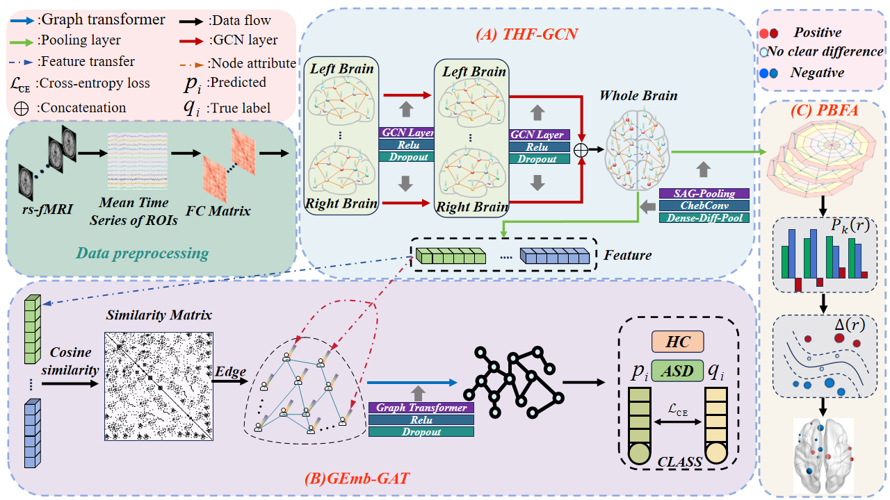

# DFAB-GCN

Paper Address：https://www.sciencedirect.com/science/article/abs/pii/S1746809426011341
DFAB-GCN：Transhemispheric Brain fusion Graph Convolution Model for ASD Diagnosis​​ 🚀 ​​State-of-the-art GNN architecture​​ for Autism Spectrum Disorder (ASD) classification using fMRI data
Unlike previous methods, this approach not only can extract biomarkers related to autism for interpretability analysis, but also for the first time explains the functional association between biomarkers and autism from a methodological perspective.

Run main.py to train the model and generate predictions. You can optionally include validation sets during runtime. For optimal performance on your own dataset, we recommend fine-tuning the relevant hyperparameters.  

Environment Setup

The environment we adopt is Python 3.10 + CUDA 12.1 (for GPU acceleration)

Core Frameworks

• PyTorch: 2.5.1+cu121 (must match CUDA version)  

• Torch Geometric: 2.6.1 For the specific installation method of Torch Geometric: 2.6.1, please search online tutorials(requires additional dependencies, see below)  
  torch_cluster==1.6.3+pt25cu121
  torch_scatter==2.1.2+pt25cu121
  torch_sparse==0.6.18+pt25cu121
  torch_spline_conv==1.2.2+pt25cu121

Installation Guide

1. Install PyTorch (CUDA 12.1 recommended for GPU support):  
   pip install torch==2.5.1+cu121 --extra-index-url https://download.pytorch.org/whl/cu121
   You can also try other installation methods
2. Install Torch Geometric and its dependencies:  
   pip install torch_geometric==2.6.1
   The installation of the torch_geometric package requires the installation of other components first. It is recommended to search for tutorials to learn

3. Install remaining dependencies:  
   pip install -r requirements.txt
   The software packages in requirements.txt may contain packages that are not necessary for this project. It is recommended to install the corresponding version of the software package according to the specific requirements of the project
   

Notes

• Some dependencies (e.g., Torch Geometric components) may require manual installation from pre-built wheels.  

🌟 ​​Happy Coding & Contributing!​​
We hope this project helps advance research in ​​ASD diagnosis​​ and inspires new innovations in ​​graph-based neuroimaging analysis​​. If you find our work useful, feel free to ⭐️ ​​star​​ the repo, 🚀 ​​fork​​ it for your own research, or 💡 ​​open an issue​​ for suggestions!

​​Wishing you breakthroughs in your AI-for-healthcare journey!​​
— The DFAB-GCN Team